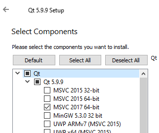

# Guide of how to install VPTV

This is a step by step guide of how to install VPTV on your PC. 
CMake was used as the building tool. The generator of cmake should be Visual Studio 2017. 
The machine type should be x64.
Currentyly, only Windows system is supported.
## Prerequisites
Before installation, several packages need to be installed first. Note that only the following 
versions of packages were tested compatitable. Please install the following package with the listed order. 

- [CMake](https://cmake.org/install/) Follow this link to install CMake. The minimum version should be 3.4. 
- [Boost 1.65.1](https://boostorg.jfrog.io/artifactory/main/release/1.65.1/binaries/) Download and install "boost_1_65_1-msvc-14.0-64.exe" for Visual Studio 2017. 
The installation directory should be C:/boost_1_65_1. If installed to another director, it needs to be specified in CMake.
- [yaml-cpp 0.6.0](https://github.com/jbeder/yaml-cpp/tree/yaml-cpp-0.6.0) Download the files from this github repository. This package is used to input and output camera parameters.
- [QT5.9.9](https://download.qt.io/archive/qt/5.9/5.9.9/) Download and install qt-opensource-windows-x86-5.9.9.exe. 
If the download link is not valid, try [these alternative mirrors](https://download.qt.io/archive/qt/5.9/5.9.9/qt-opensource-windows-x86-5.9.9.exe.mirrorlist).
Note that installation might need a QT account, you can create one during installation. 
During installation, check the box in image for Visual Studio 2017 version.  
 
- [VTK 8.2.0](https://vtk.org/download/) Download and unzip VTK-8.2.0.zip from this website. 
After unzipping, build VTK library use CMake following this [tutorial](https://vtk.org/Wiki/VTK/Configure_and_Build). Note that the building should be with QT5.
- [CUDA 10.2](https://developer.nvidia.com/cuda-10.2-download-archive?target_os=Windows&target_arch=x86_64&target_version=10&target_type=exenetwork)
Download and install CUDA 10.2. This is for parallel correspondence using GPU.
- [OpenCV 4.1.1](https://github.com/opencv/opencv/tree/4.1.1) Download the source code from this repository. Also download [Opencv-contrib-4.1.1](https://github.com/opencv/opencv_contrib/tree/4.1.1).
Unzip these two files and put them in the same folder. Since we need to use OpenCV with CUDA, QT5, and VTK, we need to build OpenCV using CMake.
I found this [tutorial](https://thinkinfi.com/install-opencv-gpu-with-cuda-for-windows-10/) very useful for OpenCV+CUDA build.
Also, do not forget to check WITH_VTK and WITH_QT boxes in CMake for QT and VTK support.
- [NP_CAMERASDK](https://www.optitrack.com/support/downloads/developer-tools.html)
Download Camera SDK 2.1.1 exe file then install it. This is used to synchronize Optitrack Cameras and output camera images.

## Build VPTV code
Download VPTV code from [this repository](https://github.com/yuzhao0215/VPTV_tutorial).
Unzip the file to an arbitrary location, e.g. "C:/VPTV". In my case, the location is: "C:\Users\45463\Desktop\vptv_tutorial".
Make sure all rerequisites packages are correctly installed. 

